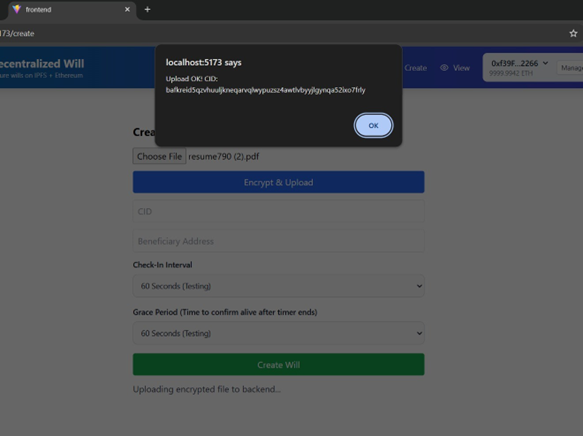
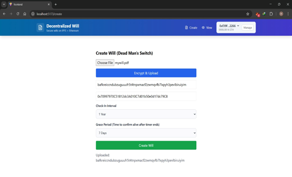
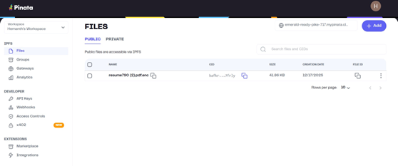
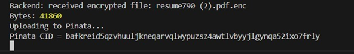
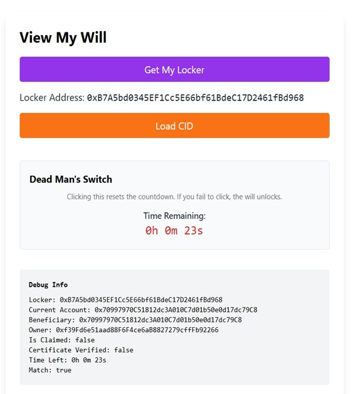
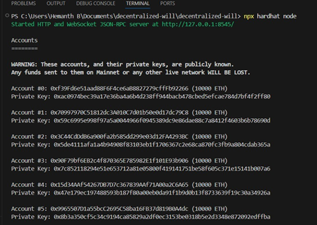
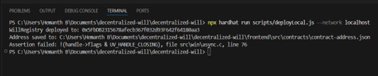
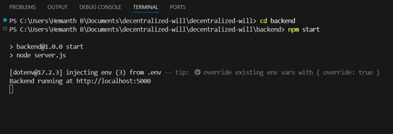
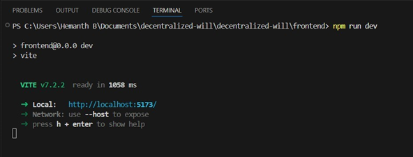
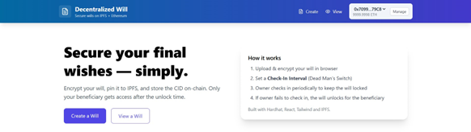

# Blockchain-Based Decentralized Will Management

A decentralized digital inheritance system built on Ethereum that enables secure will creation, encrypted document storage on IPFS, and automated beneficiary claim workflows — powered by Solidity smart contracts with a Dead Man's Switch mechanism.

## Key Features

- **Smart Contract Architecture** — Factory pattern (`WillRegistry` → `WillLocker`) with per-will isolation
- **Dead Man's Switch** — Timer-based will release with configurable check-in intervals and grace periods
- **Client-Side Encryption** — PBKDF2 + AES-GCM 256-bit encryption before IPFS upload
- **Decentralized Storage** — Encrypted documents pinned to IPFS via Pinata, CID managed on-chain
- **Death Certificate Verification** — OCR-based validation with SHA-256 integrity hashing and on-chain verification state
- **Chainlink Automation-Compatible** — `checkUpkeep()` / `performUpkeep()` upkeep logic for automated monitoring
- **MetaMask Integration** — Wallet connectivity via ethers.js BrowserProvider

## Architecture

```
┌─────────────────┐     ┌──────────────────┐     ┌─────────────────────┐
│   React/Vite    │     │  Node.js/Express  │     │    IPFS / Pinata    │
│   Frontend      │────▶│    Backend        │────▶│  Decentralized      │
│                 │     │                   │     │  Storage            │
│ • MetaMask      │     │ • Multer          │     │                     │
│ • ethers.js     │     │ • Tesseract.js    │     │ Encrypted files     │
│ • Web Crypto    │     │ • SHA-256 hashing │     │ pinned with CID     │
└────────┬────────┘     └───────────────────┘     └─────────────────────┘
         │
         │ ethers.js
         ▼
┌─────────────────────────────────────────────────┐
│              Ethereum Blockchain                 │
│                                                  │
│  WillRegistry (Factory)                          │
│    └── createWill() → deploys WillLocker         │
│                                                  │
│  WillLocker (Per-Will Contract)                  │
│    ├── checkIn()              Owner resets timer  │
│    ├── checkUpkeep()          Automation check    │
│    ├── performUpkeep()        Emit Unlocked       │
│    ├── submitDeathCertificate()  Beneficiary      │
│    ├── verifyDeathCertificate()  Verifier         │
│    ├── claim()                Beneficiary claims  │
│    └── getCID()               Access control      │
└─────────────────────────────────────────────────┘
```

## Smart Contract Design

### WillRegistry.sol — Factory Contract

- Deploys individual `WillLocker` contracts per will
- Maintains `userWills` and `beneficiaryWills` mappings
- Emits `WillCreated` event with owner and locker addresses
- Provides `getMyWills()` and `getWillsAsBeneficiary()` view functions

### WillLocker.sol — Individual Will Contract

| Function | Access | Description |
|----------|--------|-------------|
| `checkIn()` | Owner only | Resets the Dead Man's Switch timer |
| `checkUpkeep()` | Public (view) | Returns `true` if interval + grace period has elapsed |
| `performUpkeep()` | Public | Emits `Unlocked` event when conditions are met |
| `submitDeathCertificate()` | Beneficiary only | Submits SHA-256 certificate hash after expiry |
| `verifyDeathCertificate()` | Verifier only | Approves the submitted death certificate |
| `autoVerifyCertificate()` | Beneficiary only | Combined submit + verify for simplified flow |
| `claim()` | Beneficiary only | Claims the will after certificate verification |
| `getCID()` | Public (view) | Returns encrypted document CID after verification |

**Access Control**: Each function enforces `require()` checks for caller identity, timer state, and claim status.

## Demo

### Create Will — Encrypt & Upload to IPFS



### IPFS Storage (Pinata)



### Dead Man's Switch — Countdown Timer


### Infrastructure — Local Development





### Application Home Page


## How It Works

```
1. Owner connects MetaMask wallet
2. Creates a will: uploads PDF → encrypts client-side → uploads to IPFS → stores CID on-chain
3. Smart contract deploys a WillLocker with beneficiary, check-in interval, and grace period
4. Owner periodically calls checkIn() to reset the Dead Man's Switch
5. If owner fails to check in → will becomes claimable after interval + grace period
6. Beneficiary submits death certificate → backend performs OCR → validates keywords
7. Certificate SHA-256 hash is submitted to the smart contract
8. After verification, beneficiary calls claim() and retrieves the encrypted CID
9. Beneficiary decrypts the document with the owner's password
```

## Technology Stack

| Layer | Technologies |
|-------|-------------|
| **Blockchain** | Solidity ^0.8.20, Hardhat ^2.26.0, ethers.js ^6.15.0, Chainlink Contracts ^1.5.0 |
| **Frontend** | React ^18.x, Vite, Tailwind CSS, Web Crypto API (PBKDF2 + AES-GCM) |
| **Backend** | Node.js, Express.js, Tesseract.js (OCR), Pinata SDK (IPFS) |
| **Testing** | Mocha, Chai, Hardhat Network Helpers |

## Project Structure

```
decentralized-will-management/
├── contracts/                    # Solidity smart contracts
│   ├── WillRegistry.sol          # Factory contract
│   └── WillLocker.sol            # Individual will locker
├── test/                         # Smart contract tests
│   └── WillManagement.test.js    # 27 tests covering all contract functions
├── scripts/                      # Deployment and testing scripts
│   ├── deployLocal.js            # Local Hardhat deployment
│   ├── debugLocal.js             # Blockchain time manipulation
│   ├── testDeadmanSwitch.js      # Dead Man's Switch test flow
│   ├── testCertificateVerification.js  # Certificate verification test
│   ├── createWillLocal.js        # Will creation script
│   ├── claimWillLocal.js         # Will claiming script
│   └── uploadToPinata.js         # Direct IPFS upload
├── backend/                      # Express.js server
│   ├── server.js                 # API routes (upload, certificate processing)
│   └── certificateProcessor.js   # OCR + validation + SHA-256 hashing
├── frontend/                     # React application
│   ├── src/
│   │   ├── components/           # React components
│   │   │   ├── CreateWill.jsx    # Will creation form
│   │   │   ├── ViewWill.jsx      # Will viewer + Dead Man's Switch
│   │   │   ├── ConnectWallet.jsx # MetaMask integration
│   │   │   ├── DeathCertificateUpload.jsx  # Certificate upload + OCR
│   │   │   └── Home.jsx          # Landing page
│   │   ├── utils/
│   │   │   ├── crypto.js         # PBKDF2 + AES-GCM encryption/decryption
│   │   │   ├── blockchain.js     # ethers.js provider setup
│   │   │   └── ipfs.js           # IPFS gateway utilities
│   │   └── contracts/            # Contract ABIs
│   └── vite.config.js
├── screenshots/                  # Application demo screenshots
└── hardhat.config.js             # Hardhat configuration
```

## Getting Started

### Prerequisites
- Node.js v16+
- MetaMask browser extension

### Installation

```bash
# Clone the repository
git clone https://github.com/PavanKunthe/decentralized-will-management.git
cd decentralized-will-management

# Install root dependencies (Hardhat & smart contracts)
npm install

# Install backend dependencies
cd backend && npm install && cd ..

# Install frontend dependencies
cd frontend && npm install && cd ..
```

### Environment Configuration

Create `backend/.env`:
```
PINATA_API_KEY=your_pinata_api_key
PINATA_SECRET_API_KEY=your_pinata_secret_key
PORT=5000
```

### Running Locally

You need three terminals:

**Terminal 1 — Local Blockchain**
```bash
npx hardhat node
```

**Terminal 2 — Backend Server**
```bash
cd backend && npm start
```

**Terminal 3 — Deploy & Start Frontend**
```bash
npx hardhat run scripts/deployLocal.js --network localhost
cd frontend && npm run dev
```

### MetaMask Setup
1. Switch network to Localhost 8545
2. Import test accounts from Terminal 1 (copy private keys)
3. Import at least 2 accounts: Owner and Beneficiary

## Testing

Run the smart contract test suite:

```bash
npx hardhat test
```

The test suite covers 27 test cases including:
- Registry deployment and will creation
- Owner check-in and access control
- Dead Man's Switch expiration logic
- `checkUpkeep()` / `performUpkeep()` automation
- Death certificate submission and verification
- Claim restrictions and CID access control

## Security Considerations

- **Encryption**: Client-side AES-GCM 256-bit encryption with PBKDF2 key derivation (100,000 iterations, random salt)
- **Access Control**: Smart contract `require()` checks enforce owner/beneficiary restrictions on every function
- **Certificate Integrity**: SHA-256 hashing prevents certificate tampering
- **Grace Period**: Configurable grace period prevents accidental will releases
- **CID Protection**: `getCID()` requires both timer expiry and certificate verification

> **Note**: The `autoVerifyCertificate()` function provides a simplified verification flow. In production, certificate verification should involve independent trusted verifiers or oracle-based validation. Chainlink Automation integration is compatible but not deployed to a live keeper network.

⚠️ **Never commit private keys or API keys to version control.**

## Acknowledgments

- [Hardhat](https://hardhat.org/) — Ethereum development environment
- [OpenZeppelin](https://www.openzeppelin.com/) — Smart contract standards
- [Chainlink](https://chain.link/) — Automation infrastructure
- [Pinata](https://www.pinata.cloud/) — IPFS pinning service
- [Tesseract.js](https://tesseract.projectnaptha.com/) — OCR processing

## License

ISC
